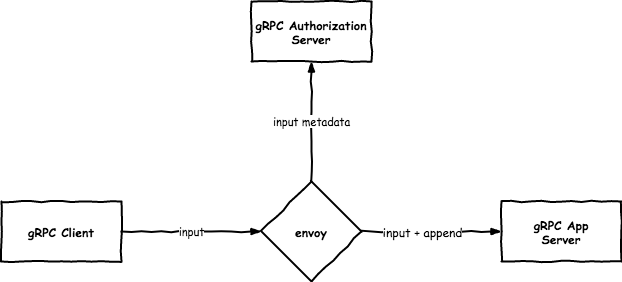

# envoy-external-authz

- Go programs that demonstrate [envoy external authorization](https://www.envoyproxy.io/docs/envoy/v1.13.1/intro/arch_overview/security/ext_authz_filter.html)
- envoy v1.13.1



## Run
```bash
$ docker-compose up
```
